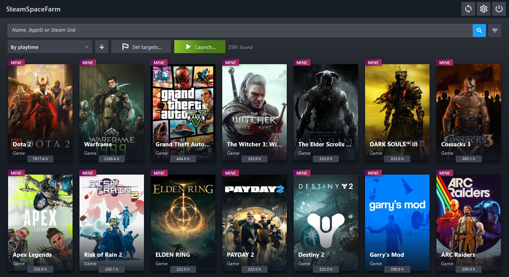

<h1 align="center">SteamSpaceFarm</h1>

<p align="center">
  
</p>

<p align="center">
  <strong>Your Steam library. Your playtime goals. One place to manage it all.</strong>
</p>

SteamSpaceFarm is a Windows desktop app for browsing your Steam library and managing simulated game sessions. Pick your apps, set time targets, and let SSF handle the queue through the Steam client.

[Download for Windows](https://github.com/CarapacikSpace/SteamSpaceFarm/releases/latest) · [Русский](README.ru.md) · [Changelog](CHANGELOG.md) · [Report an issue](https://github.com/CarapacikSpace/SteamSpaceFarm/issues)



## Connect Steam once

Sign in by scanning a QR code in the Steam mobile app or entering your account name and password. Steam Guard supports both mobile approval and verification codes when requested by Steam.

SSF protects the saved session with Windows DPAPI and reuses it for later library updates. Steam settings show your current session status, a refresh button, and progress while the library is loading.

## See your library clearly

- Browse personal and Steam Family apps, including hidden and private entries returned for your account.
- See names, recorded playtime, and last-played data when Steam provides them.
- Find apps by name, AppID, or Steam link; filter by type, ownership, status, and playtime.
- Sort in either direction by name, playtime, last played, or remaining time to a target.
- Choose portrait covers, landscape capsules, store headers, or compact icons, with artwork fallbacks.

You can add AppIDs manually, edit local app details, and set ownership overrides. Ownership distinguishes **Mine**, **Steam Family**, and an unknown value. Steam can expose additional apps through its account data, so totals may differ from its visible library counters.

## Run sessions your way

Launch individual apps or start a queue from marked apps, favorites, or the current catalog selection. The simultaneous session limit is configurable from 1 to 30.

Set automatic stop targets, mark a playtime range, or aim for your preferred hour milestones. Sequential mode visits visible apps one at a time, with configurable durations, delays, and ordering. Bulk actions show the affected app count before confirmation.

Normal batch starts and stops are spaced apart. **Stop all** immediately terminates SSF's game runners and library helper operations. Each simulated game uses a separate `ssf_game.exe` for independent monitoring and stopping.

Sessions are emulated through the Steam API. Steam determines session acceptance and recorded playtime. Manual changes to playtime and ownership apply to SSF's local catalog.

## Keep it comfortable

- Favorites, per-app context menus, editable time targets, and quick AppID copying.
- A fixed search and sorting bar, overlay filters, and keyboard-accessible menus.
- English and Russian throughout the interface.
- Separate controls for refreshing the library, signing out, and clearing the cache.

Clearing the library cache keeps your Steam session ready for the next refresh. Signing out removes the saved session and clears the library cache.

## Get started

1. Download the Windows x64 archive from [Releases](https://github.com/CarapacikSpace/SteamSpaceFarm/releases/latest).
2. Extract the **entire archive** into a folder and run `ssf.exe`.
3. Open Steam integration in settings, sign in, and load your library.
4. Keep the Steam desktop client running and signed in to the appropriate account when starting simulated game sessions.

The Windows release includes both helper executables and their runtime components. Internet access is required for Steam sign-in, library updates, and artwork. Windows x64 is the supported release target.

## Your data

Writable data lives in Flutter's application support directory. For the Windows release:

```text
%APPDATA%\CarapacikSpace\SteamSpaceFarm\
```

The library is readable JSON in `library/catalog.json`; the protected Steam session is in `steam/session.dpapi`. Settings and helper extraction files use the same application directory. Keep the complete release folder together: SSF reads executable files from the bundle.

## Build from source

Install Flutter stable with its bundled Dart SDK, a .NET 10 SDK, and Visual Studio's **Desktop development with C++** workload with a Windows SDK. The C++ toolchain builds Flutter's Windows host and the NativeAOT game runner. Application logic is Dart and C#.

From the repository root, in PowerShell:

```powershell
./tools/windows/build_steam_game.ps1
./tools/windows/build_steam_library_helper.ps1
cd ssf_flutter
flutter pub get
cd ..
./tools/windows/generate_localizations.ps1
cd ssf_flutter
flutter build windows --release
```

The bundle is written to `ssf_flutter/build/windows/x64/runner/Release/`. Build both helpers first: Flutter's CMake configuration copies their fresh outputs from the C# projects. Localization generation runs `dart pub global run intl_utils:generate` through a global `intl_utils` installation.

| Directory | Purpose |
| --- | --- |
| `ssf_flutter/` | Catalog, settings, sign-in UI, and session queues |
| `ssf_steam_helper/` | SteamKit authentication and library collection; self-contained .NET executable |
| `ssf_game/` | One Steam app session per NativeAOT process, using the Steam API DLL directly |
| `tools/windows/` | Build and localization scripts used by CI |
| `redistributable_bin/` | Steamworks redistributables |
| `docs_new/` | Architecture notes and implementation reports |

Flutter communicates with child processes using newline-delimited JSON over standard input/output.

## Contribute

[Open an issue](https://github.com/CarapacikSpace/SteamSpaceFarm/issues) for a bug or feature request. Include the SSF version, Windows version, steps to reproduce, and the visible error text. Keep account credentials and session files private. Pull requests are welcome; user-facing text should be localized in English and Russian.

Join our [Discord server](https://discord.gg/Wy78VE6mdq) to discuss ideas, ask questions, and share feedback.
