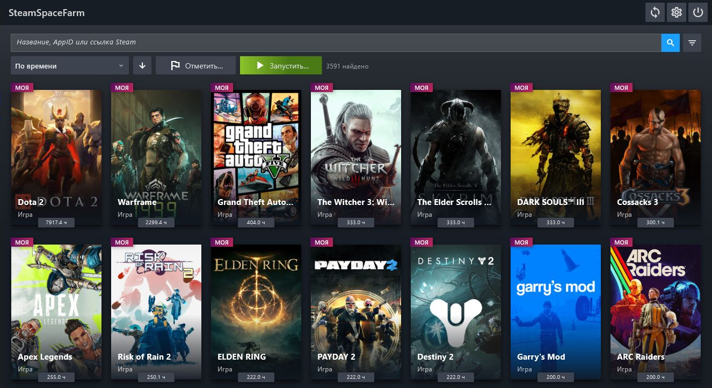

<h1 align="center">SteamSpaceFarm</h1>

<p align="center">
  
</p>

<p align="center">
  <strong>Ваша библиотека Steam, цели по времени и управление сеансами — в одном приложении.</strong>
</p>

SteamSpaceFarm — приложение для Windows, которое помогает просматривать библиотеку Steam и управлять эмуляцией игровых сеансов. Выберите приложения, задайте цели по времени и запустите очередь через клиент Steam.

[Скачать для Windows](https://github.com/CarapacikSpace/SteamSpaceFarm/releases/latest) · [English](README.md) · [История изменений](CHANGELOG.md) · [Сообщить об ошибке](https://github.com/CarapacikSpace/SteamSpaceFarm/issues)



## Войдите в Steam один раз

Отсканируйте QR-код в мобильном приложении Steam или введите логин и пароль. Если Steam запросит Steam Guard, можно подтвердить вход в приложении или ввести проверочный код.

SSF защищает сохранённую сессию через Windows DPAPI и использует её для следующих обновлений библиотеки. В настройках Steam видны статус сессии, кнопка обновления и прогресс загрузки.

## Вся библиотека под рукой

- Личные приложения и Steam Family, включая скрытые и приватные записи, доступные вашему аккаунту.
- Названия, наигранное время и последний запуск, когда Steam возвращает эти данные.
- Поиск по названию, AppID и ссылке Steam; фильтры по типу, принадлежности, состоянию и времени.
- Сортировка в обе стороны по названию, времени, последнему запуску и оставшемуся времени до цели.
- Портретные обложки, горизонтальные капсулы, заголовки магазина и компактные иконки с запасными источниками изображений.

Можно вручную добавить AppID, изменить локальные данные и задать принадлежность. Разделение учитывает **Мои**, **Steam Family** и неизвестное значение. Steam может возвращать дополнительные приложения в данных аккаунта, поэтому счётчики иногда отличаются от видимой библиотеки.

## Сеансы под вашим контролем

Запускайте отдельные приложения или очередь из отмеченных игр, избранного и текущей выборки каталога. Лимит одновременных сеансов настраивается от 1 до 30.

Задайте цель автоостановки, отметьте диапазон времени или выберите желаемые «красивые» часы. Последовательный режим проходит видимые приложения по одному с заданными длительностями, задержками и порядком. Массовые действия показывают количество приложений перед подтверждением.

Обычные массовые запуски и остановки выполняются с небольшими задержками. **Остановить всё** немедленно завершает игровые runner-процессы SSF и операции helper. Каждая эмулируемая игра использует отдельный `ssf_game.exe` для независимого отслеживания и остановки.

Сеансы эмулируются через Steam API. Steam определяет принятие сеанса и учёт времени. Ручное изменение часов и принадлежности применяется к локальному каталогу SSF.

## Удобство в деталях

- Избранное, контекстные меню, редактируемые цели времени и копирование AppID.
- Закреплённая панель поиска и сортировки, фильтры поверх каталога и управление меню с клавиатуры.
- Английский и русский языки во всём интерфейсе.
- Отдельные действия для обновления библиотеки, выхода из аккаунта и очистки кеша.

Очистка кеша сохраняет сессию для следующего обновления библиотеки. Выход из аккаунта удаляет сохранённую сессию и очищает кеш библиотеки.

## Начало работы

1. Скачайте архив для Windows x64 из [Releases](https://github.com/CarapacikSpace/SteamSpaceFarm/releases/latest).
2. Распакуйте **весь архив** в одну папку и запустите `ssf.exe`.
3. В настройках откройте интеграцию Steam, войдите и загрузите библиотеку.
4. Для запуска эмулируемых сеансов клиент Steam должен работать с подходящим аккаунтом.

Релиз содержит оба helper-приложения и компоненты среды выполнения. Интернет нужен для входа, обновления библиотеки и обложек. Поддерживаемая платформа релиза — Windows x64.

## Данные приложения

Все изменяемые файлы находятся в каталоге поддержки приложения Flutter. В Windows-сборке это:

```text
%APPDATA%\CarapacikSpace\SteamSpaceFarm\
```

Библиотека хранится в читаемом JSON `library/catalog.json`, защищённая сессия Steam — в `steam/session.dpapi`. Настройки и файлы распаковки helper используют тот же каталог. Файлы релиза нужно держать вместе: SSF читает исполняемые файлы из комплекта поставки.

## Сборка и разработка

Нужны Flutter stable с входящим в него Dart SDK, .NET 10 SDK и Visual Studio с компонентами **Desktop development with C++** и Windows SDK. C++-инструменты собирают Windows-оболочку Flutter и NativeAOT runner. Логика приложения написана на Dart и C#.

Из корня репозитория, в PowerShell:

```powershell
./tools/windows/build_steam_game.ps1
./tools/windows/build_steam_library_helper.ps1
cd ssf_flutter
flutter pub get
cd ..
./tools/windows/generate_localizations.ps1
cd ssf_flutter
flutter build windows --release
```

Результат находится в `ssf_flutter/build/windows/x64/runner/Release/`. Сначала собираются оба helper: CMake Flutter копирует свежие результаты из C#-проектов. Генерация переводов выполняет `dart pub global run intl_utils:generate` через глобальный `intl_utils`.

| Каталог | Назначение |
| --- | --- |
| `ssf_flutter/` | Каталог, настройки, интерфейс входа и очереди |
| `ssf_steam_helper/` | SteamKit, авторизация и библиотека; автономный .NET EXE |
| `ssf_game/` | Отдельный NativeAOT-процесс на AppID, прямые вызовы Steam DLL |
| `tools/windows/` | Сборка и генерация переводов для CI |
| `redistributable_bin/` | Библиотеки Steamworks |
| `docs_new/` | Архитектура и отчёты о реализации |

Flutter общается с дочерними процессами через JSON по строкам в stdin/stdout.

## Обратная связь

[Создайте issue](https://github.com/CarapacikSpace/SteamSpaceFarm/issues), приложив версию SSF, версию Windows, шаги воспроизведения и текст ошибки. Данные входа и файлы сессии держите в секрете. Предложения и pull request приветствуются; новые тексты интерфейса должны иметь английский и русский перевод.

Присоединяйтесь к нашему [Discord-серверу](https://discord.gg/Wy78VE6mdq), чтобы обсудить идеи, задать вопросы и поделиться обратной связью.
